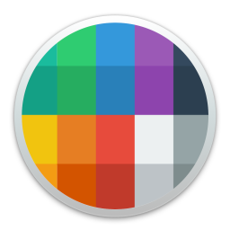
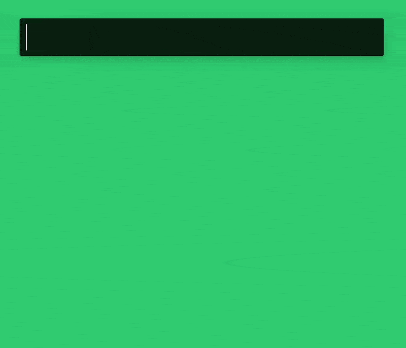

<h1 align="center">Welcome to Alfred Flat UI Colors 👋</h1>




> An Alfred workflow to get Flat UI Colors fast

[](https://github.com/drunkensouljah/alfred-flat-ui-colors) [](https://github.com/drunkensouljah/alfred-flat-ui-colors/blob/main/LICENSE "Show License") [](https://nodejs.org "Go to Node.js homepage") [](https://github.com/xojs/xo) [](https://www.npmjs.com/package/alfred-flat-ui-colors "Go to NPM project page") [](https://www.alfredapp.com/ "Go to Alfred homepage")

Gain access to 280 handpicked colors from 14 palettes, ready for COPY & PASTE through this Alfred workflow. It utilizes [Flat UI Colors 2](https://flatuicolors.com/) by Ahmet Sulek (unofficially). Requires [Node.js >=18](https://nodejs.org) along with [Alfred 4 or later](https://www.alfredapp.com) with the paid [Powerpack](https://www.alfredapp.com/powerpack/) upgrade to operate.

<br>

## Getting started

### Prerequisites

You need [Node.js 18+](https://nodejs.org) and [Alfred 4 or later](https://www.alfredapp.com) with the paid [Powerpack](https://www.alfredapp.com/powerpack/) upgrade.

### Install

```sh
npm install --global alfred-flat-ui-colors
```

## Usage

In Alfred, type `flat` and press <kbd>↩ Enter</kbd>. To find a specific color, enter a query with a color name. The chosen color's hex code will be copied to your clipboard and pasted into the frontmost app.

Hold down <kbd>⌘ CMD</kbd> while selecting a color to reveal its hex value. Press <kbd>⌥ OPTION</kbd> to display the RGB code of the chosen color. For copying and pasting the RGB code, continue holding <kbd>⌥ OPTION</kbd> and press <kbd>↩ Enter</kbd>.

<p align="center">
    
</p>

## Development

### Clone the repository

```sh
git clone https://github.com/drunkensouljah/alfred-flat-ui-colors.git
```

### Install dependencies

```sh
npm install
```

### Run tests

```sh
npm run test
```

## 🤝 Contributing

Contributions are what make the open source community such an amazing place to learn, inspire, and create. Any contributions you make are **greatly appreciated**.

If you have a suggestion that would make this better, please fork the repo and create a pull request. You can also simply [open an issue](https://github.com/drunkensouljah/alfred-flat-ui-colors/issues).

1. Fork the Project
2. Create your Feature Branch (`git checkout -b feature/AmazingFeature`)
3. Commit your Changes (`git commit -m 'Add some AmazingFeature'`)
4. Push to the Branch (`git push origin feature/AmazingFeature`)
5. Open a Pull Request

See the [open issues](https://github.com/drunkensouljah/alfred-flat-ui-colors/issues) for a full list of proposed features (and known issues).

## Changelog

### [0.0.2] - 2023-11-15

- Add functionality to output RGB color codes
- Introducing modifier-keys for displaying (and copy and paste) hex and RGB color codes.

### [0.0.1] - 2023-11-14

- First release. Add basic functionality to copy and paste hex color code when pressed

## Show your support

Give a ⭐️ if this project helped you!

## 📝 License

Copyright © 2023 [Daniel Blatt](https://github.com/drunkensouljah).<br />
This project is [MIT](https://github.com/drunkensouljah/alfred-flat-ui-colors/blob/main/LICENSE) licensed.

## 👏 Credits

This open source project was made possible with the help of the following individuals, libraries, and resources:

- [Palettes | Flat UI Colors 🎨 280 handpicked colors ready for COPY & PASTE](https://flatuicolors.com/)
- palettes.json generated with [akx/flat-ui-colors-json](https://github.com/akx/flat-ui-colors-json)
- [jimp-dev/jimp: An image processing library written entirely in JavaScript for Node, with zero external or native dependencies.](https://github.com/jimp-dev/jimp)
- [sindresorhus/alfy: Create Alfred workflows with ease](https://github.com/sindresorhus/alfy)
- [Alfred - Productivity App for macOS](https://www.alfredapp.com/)
